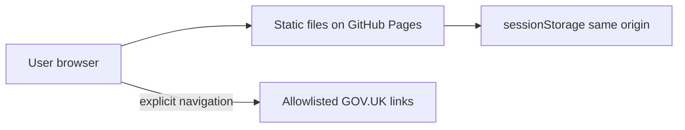

# Security & privacy architecture

This document describes how the Financial Guidance tool protects user data, what we assume, and what we cannot guarantee. It is the source of truth for security-related design decisions in this repository.

## Product principles

1. **Guidance only** — not regulated personal financial advice.
2. **Client-only processing** — financial inputs are not sent to an application backend operated by this project.
3. **Session-scoped storage** — user inputs live in `sessionStorage` until the tab/session ends or the user chooses **Start over**.

## Architecture overview

| Layer | Implementation | Data leaves device? |
|-------|----------------|---------------------|
| Hosting | GitHub Pages (static `out/` artefact) | No user financial data |
| Application | Next.js static export, client components | No intentional egress |
| Persistence | `sessionStorage` keys (`fg-*`) | Stays on device |
| External links | Hard-coded allowlist (`www.gov.uk` only) | User leaves app voluntarily |

## Threat model

### In scope

| Threat | Mitigation (current / planned) |
|--------|--------------------------------|
| Accidental data collection by our stack | No API routes, no analytics, no form POST |
| XSS reading `sessionStorage` | React escaping, no `dangerouslySetInnerHTML`, CSP |
| Silent exfiltration via `fetch` | CSP `connect-src 'self'` |
| Tampered outbound links in our build | URL allowlist + `ExternalLink` component |
| Clickjacking / tab-nabbing | CSP `frame-ancestors 'none'`, `rel="noopener noreferrer"` |
| Supply-chain / deploy tampering | Lockfile, GitHub Actions deploy, branch protection (recommended) |
| Misleading privacy claims | This document + in-app `/security/` page |

### Out of scope (honest limits)

| Threat | Why we cannot fully prevent it |
|--------|--------------------------------|
| OS keyloggers / screen capture | Outside the browser sandbox |
| Malicious browser extensions | Same-origin JS can read the DOM and storage |
| Shoulder surfing on shared devices | Physical / social |
| **Spoofed copy of the site** hosted elsewhere | Anyone can clone a public static repo or imitate the UI on another domain |
| Compromised user device | Local malware |

## Spoofed or malicious copies of the site

**We cannot prevent someone from hosting a lookalike version of this tool on another URL.** Static sites are easy to copy once published.

What helps users identify the **real** tool:

- Publish and repeat the **official URL** (e.g. `https://<org>.github.io/financial-guidance-for-under-45s/`) on the welcome and security pages.
- Prefer a **custom domain** later with consistent branding.
- **HTTPS** on the official host (GitHub Pages provides this).
- **HSTS** is enforced by GitHub Pages for `*.github.io`; it does not stop users visiting a fake domain they typed or clicked elsewhere.
- Do **not** ask users to paste financial data into any other site claiming to be this tool.

What we do **not** have (and would be disproportionate for v1):

- Code signing of HTML for browsers to verify publisher identity.
- DNSSEC or proprietary “app attestation” for a static web page.
- Legal takedown of clone sites (organisational process, not app code).

## Content Security Policy (CSP)

GitHub Pages does not let us set HTTP response headers for project sites, so CSP is applied via a `<meta http-equiv="Content-Security-Policy">` tag in the root layout.

Policy goals:

- **`default-src 'self'`** — only load scripts/styles/assets from this origin by default.
- **`connect-src 'self'`** — block background network calls to third parties (limits XSS exfiltration).
- **`frame-ancestors 'none'`** — reduce clickjacking via iframes.
- **`base-uri 'self'`** — prevent base-tag hijacking.
- **`form-action 'self'`** — forms cannot submit elsewhere.
- **`object-src 'none'`** — no plugins.
- **`upgrade-insecure-requests`** (production) — prefer HTTPS.

Next.js and Tailwind require `'unsafe-inline'` for styles in this setup. Production avoids `'unsafe-eval'`.

Implementation: `src/lib/security/content-security-policy.ts`

## External link allowlist

All external links must use `ExternalLink` and a URL defined in `src/lib/security/allowed-external-urls.ts`.

Current allowlist:

| URL | Purpose |
|-----|---------|
| `https://www.gov.uk/apply-for-council-tax-discount` | Council tax discount signposting |
| `https://www.gov.uk/jobseekers-allowance` | JSA signposting |

Rules for adding URLs:

1. Must be `https://`
2. Host must be `www.gov.uk` or `gov.uk`
3. Add the exact URL to the allowlist constant
4. Use `ExternalLink` in UI — never raw `<a href="https://...">` for third parties

## Storage keys

| Key | Content |
|-----|---------|
| `fg-user-age` | Age band routing |
| `fg-journey-progress` | Journey step |
| `fg-everyday-living` | Everyday living form JSON |

**Start over** clears all of the above via `clearUserData()`.

## Third parties

**Default: none at runtime.**

- Fonts: bundled via `next/font` (no Google Fonts CDN at runtime).
- No analytics, error reporting, or social widgets without updating this document and relaxing CSP deliberately.

## Deployment hardening (recommended)

- Require PR review before merge to `main`.
- Restrict who can edit `.github/workflows/`.
- Enable GitHub Actions deploy only from `main`.
- Run `npm audit` periodically; pin dependencies via `package-lock.json`.

## Future considerations

- Pre/post-tax income adjustment (still client-side).
- Optional in-browser encryption with a user passphrase (raises UX cost; does not stop XSS while unlocked).
- Custom domain + security.txt pointing to this page.
- HTTP headers via a reverse proxy if moving off raw GitHub Pages meta CSP.

## Related pages

- In-app summary: `/security/`
- User-facing privacy copy: welcome page **Privacy badge**
